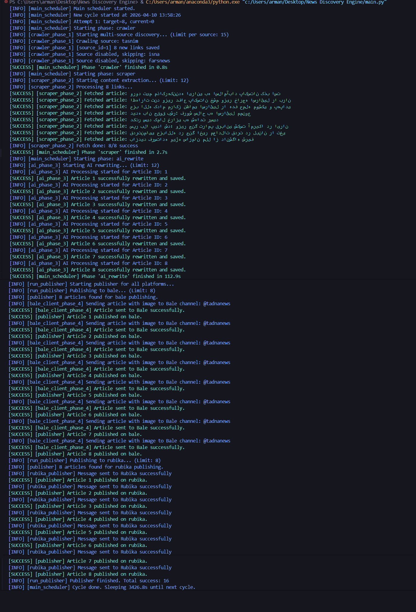

<div dir="rtl" style="text-align: right; font-family: Vazirmatn;">

# 📰 News Discovery Engine

یک موتور اتوماسیون خبری ۴ فازی برای:
1) کشف لینک خبر  
2) استخراج و پاکسازی محتوا  
3) بازنویسی با هوش مصنوعی  
4) انتشار خودکار در پیام‌رسان‌ها (بله / روبیکا)




## ✨ Features

- ✅ معماری ماژولار (Crawler / Scraper / AI / Publisher)
- ✅ زمان‌بندی چرخه‌ای (Main Scheduler)
- ✅ پشتیبانی چند منبع خبری (Tasnim / ISNA / Fars)
- ✅ Retry هوشمند برای خطاهای شبکه و HTTP
- ✅ Circuit Breaker ساده برای منابع مشکل‌دار
- ✅ جلوگیری از محتوای تکراری با `content_hash`
- ✅ ثبت لاگ سیستمی در دیتابیس + خروجی رنگی کنسول
- ✅ انتشار چندسکویی با `PublishLog` و کنترل تکرار
- ✅ خروجی AI به‌صورت JSON معتبر (با `response_format`)


## 🏗️ Architecture
```text
Phase 1: Discovery (Crawler)
  -> ذخیره لینک‌ها در links

Phase 2: Scraper (Fetcher + Parsers)
  -> استخراج title / clean_text / image_url
  -> ذخیره مقاله در articles

Phase 3: AI Rewrite
  -> بازنویسی عنوان و متن
  -> ذخیره خروجی در ai_processing

Phase 4: Publisher
  -> انتشار در Bale / Rubika
  -> ثبت وضعیت در publish_log

```

## 📁 Project Structure
```
text
News Discovery Engine/
├─ ai/
│  └─ rewrite.py
├─ database/
│  ├─ db.py
│  └─ models.py
├─ discovery/
│  ├─ crawler.py
│  └─ sources.py
├─ scraper/
│  ├─ fetcher.py
│  └─ parsers.py
├─ publisher/
│  ├─ bale.py
│  ├─ rubika.py
│  └─ publisher.py
├─ utils/
│  ├─ logger.py
│  ├─ retry.py
│  ├─ http_client.py
│  └─ source_health.py
├─ run_01_crawler.py
├─ run_02_scraper.py
├─ run_03_ai.py
├─ run_04_publisher.py
├─ init_db.py
└─ main.py
```

## ⚙️ Requirements
```
- Python 3.10+
- SQLite (پیش‌فرض) یا هر دیتابیس سازگار با SQLAlchemy
- API Key برای مدل بازنویسی
- Token برای ربات بله و روبیکا
```

## 🚀 Quick Start

### 1) Clone
```
bash
git clone https://github.com/<your-username>/news-discovery-engine.git
cd news-discovery-engine
```

### 2) Create venv & install
```
bash
python -m venv .venv
```
#### Windows:
```
.venv\Scripts\activate
```
#### Linux/Mac:
```
source .venv/bin/activate
```
#### Install:
```
pip install -r requirements.txt
```

### 3) Configure `.env`
یک فایل `.env` بسازید:

env
```
# Database
DATABASE_URL=sqlite:///news.db

# AI (GapGPT/OpenAI-compatible)
GAPGPT_API_KEY=YOUR_API_KEY
GAPGPT_BASE_URL=https://api.gapgpt.app/v1
GAPGPT_MODEL=gpt-4o-mini

# Bale
BALE_BOT_TOKEN=YOUR_BALE_BOT_TOKEN
BALE_CHANNEL_ID=@your_channel

# Rubika
RUBIKA_TOKEN=YOUR_RUBIKA_TOKEN
RUBIKA_CHAT_ID=@your_channel

# Sources (optional)
SOURCE_TASNIM_ENABLED=true
SOURCE_ISNA_ENABLED=false
SOURCE_FARS_ENABLED=false
```

### 4) Init database
```
bash
python init_db.py
```

### 5) Run phases manually
```
bash
python run_01_crawler.py
python run_02_scraper.py
python run_03_ai.py
python run_04_publisher.py
```

### 6) Run scheduler
```
bash
python main.py
```

## 🧠 Data Model (Summary)

- `sources`: منابع خبری
- `links`: لینک‌های کشف‌شده + وضعیت crawl/fetch
- `articles`: خروجی استخراج محتوا
- `ai_processing`: خروجی بازنویسی AI
- `publish_log`: وضعیت انتشار برای هر پلتفرم
- `system_logs`: لاگ‌های داخلی سیستم

```

## 🔁 Retry & Reliability

- `utils/retry.py`: مدیریت retry برای خطاهای شبکه/HTTP
- `utils/http_client.py`: Session پایدار با `Retry` داخلی
- `utils/source_health.py`: بلوکه موقت منبع مشکل‌دار (Circuit Breaker)
- جلوگیری از انتشار تکراری با `UniqueConstraint(article_id, platform)`

```

## 🛠️ Configurable Parameters

- `main.py`
  - `CYCLE_SECONDS`
  - `GAP_SECONDS`
  - `TARGET_PUBLISHED`
  - `MAX_TRIES_PER_CYCLE`
- `run_0x_*.py`
  - limit هر فاز (crawl/fetch/ai/publish)

```

## 📌 Notes

- پروژه در حالت فعلی روی **خبرهای دارای تصویر** منتشر می‌کند.
- اگر `clean_text` یا `image_url` خالی باشد، مقاله در فاز Scraper رد می‌شود.
- خروجی AI باید JSON معتبر شامل `title` و `content` باشد.

```

## 🔒 Security

- هرگز `.env`، توکن‌ها و کلیدها را commit نکنید.
- از `.gitignore` مناسب استفاده کنید.

نمونه:
gitignore
.venv/
__pycache__/
*.pyc
.env
news.db

```

## 🗺️ Roadmap

- [ ] Dockerize کامل پروژه
- [ ] پنل مانیتورینگ (FastAPI + Admin)
- [ ] تست واحد/یکپارچه
- [ ] صف پردازش (Celery/RQ)
- [ ] افزوده شدن WordPress Publisher

```

## 📄 License
``` 
MIT
```

## 👤 Author:
```
اگر این پروژه برات مفید بود ⭐️ بده.
```

</div>